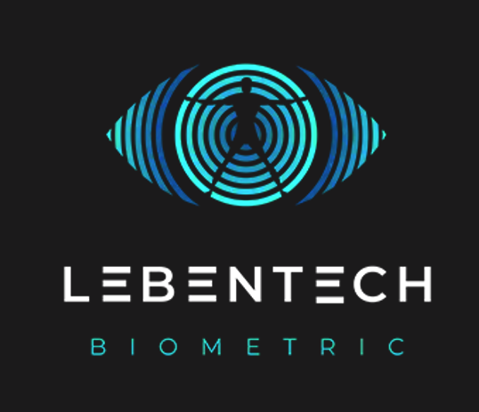

<h1 align="center">
   
  
   
  Lebentech torniquetes
   
</h1>

<h5 align="center">Aplicación para el acceso en torniquetes a las sedes de Grupo salinas utilizando servicios de reconocimiento facial.</h5>

  
  
  
  

